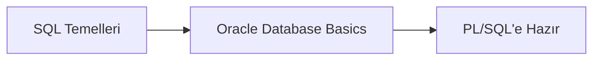
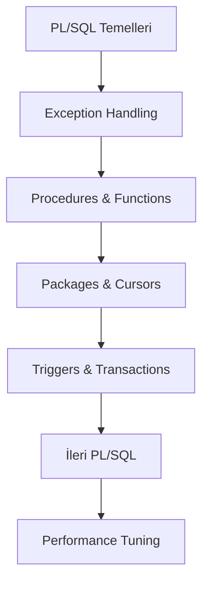
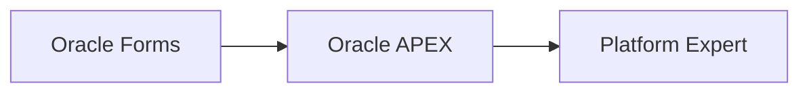
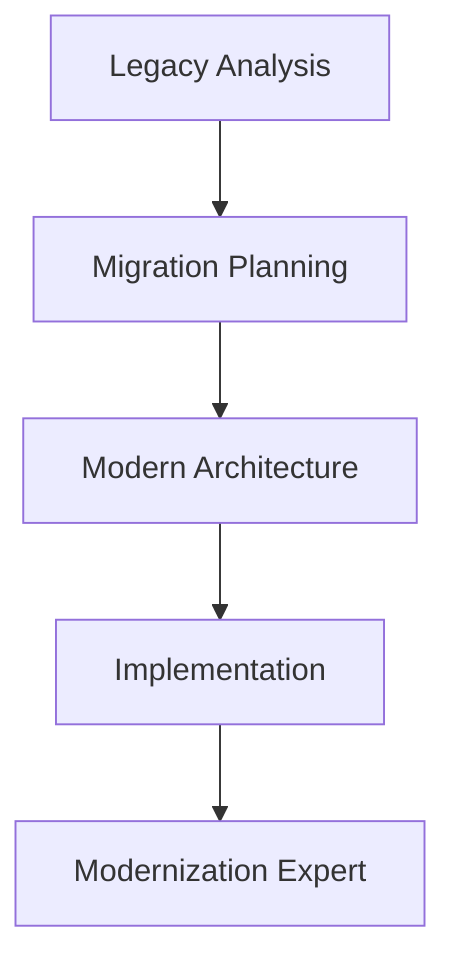

# 🗃️ PL/SQL ve Oracle Kapsamlı Öğrenme Dökümantasyonu

**Hazırlayan:** Ömer Ada

Hiç PL/SQL bilmeyen birinin Oracle ecosystem'inde expert seviyeye ulaşması için hazırlanmış kapsamlı öğrenme rehberidir. Bu dökümantasyon, SQL temellerinden başlayarak Oracle Forms modernizasyonuna kadar olan tüm süreci sistematik olarak kapsar.

## 📚 Dökümantasyon Yapısı

```
📁 PL/SQL Öğrenme Yolculuğu
│
├── 🏗️ TEMEL GEREKSİNİMLER
│   ├── 00_SQL_Temelleri.md                    📘 SQL Foundation & Oracle Functions
│   └── 00a_Oracle_Database_Temelleri.md       📘 Database Architecture & Administration
│
├── 🚀 PL/SQL DEVELOPMENT
│   ├── 01_PLSQL_Temelleri.md                  📗 PL/SQL Basics & Syntax
│   ├── 02_Exception_Handling.md               📗 Error Management & Best Practices
│   ├── 03_Procedure_Function.md               📗 Modular Programming
│   ├── 04_Package_Cursor.md                   📗 Advanced PL/SQL Structures
│   ├── 05_Trigger_Transaction.md              📗 Database Triggers & Transactions
│   ├── 09_Ileri_PLSQL.md                     📕 Collections, Dynamic SQL, Object Types
│   └── 10_Performance_Tuning.md              📕 Optimization Techniques
│
├── 💻 PLATFORM DEVELOPMENT
│   ├── 06_Oracle_Forms_Mimari.md              📙 Forms Architecture & Development
│   └── 11_Oracle_APEX.md                     📙 Modern Web Development
│
├── 🔄 MODERNIZATION
│   └── 07_Modernizasyon_Mikroservis.md        📔 Legacy to Microservices Migration
│
└── 🗺️ SUMMARY & ROADMAP
    └── 12_Ozet_Yol_Haritasi.md               📋 Complete Learning Path & Career Guide
```

## 🎯 Öğrenme Seviyeleriniz

### 📘 Foundation Level (0-2 Hafta)

**Hedef:** SQL ve Oracle Database temellerini öğrenmek

- ✅ SQL komutları (SELECT, INSERT, UPDATE, DELETE)
- ✅ JOIN operations ve subqueries
- ✅ Oracle Database architecture
- ✅ Tablespace ve schema management

### 📗 Beginner Level (3-6 Hafta)

**Hedef:** PL/SQL ile programming yapabilmek

- ✅ PL/SQL block structure
- ✅ Variables, loops, conditions
- ✅ Exception handling
- ✅ Procedures ve functions
- ✅ Packages ve cursors

### 📕 Intermediate Level (7-10 Hafta)

**Hedef:** Advanced PL/SQL techniques

- ✅ Collections (Arrays, Nested Tables, VARRAYs)
- ✅ Dynamic SQL programming
- ✅ Object-oriented programming
- ✅ Performance optimization

### 📙 Advanced Level (11-14 Hafta)

**Hedef:** Platform development expertise

- ✅ Oracle Forms development
- ✅ Oracle APEX web applications
- ✅ Master-detail relationships
- ✅ Advanced UI components

### 📔 Expert Level (15-20 Hafta)

**Hedef:** Modernization specialist

- ✅ Legacy system analysis
- ✅ Migration strategies
- ✅ Microservices architecture
- ✅ Modern development practices

## 🛣️ Öğrenme Yol Haritası

### Aşama 1: Temel Hazırlık (1-2 Hafta)



### Aşama 2: PL/SQL Development (3-8 Hafta)



### Aşama 3: Platform Expertise (9-12 Hafta)



### Aşama 4: Modernization (13-16 Hafta)



## ⭐ Özellikler

- **🇹🇷 Türkçe İçerik:** Tüm açıklamalar Türkçe, anlaşılır ve örneklerle desteklenmiş
- **📈 Aşamalı Öğrenme:** Temellerden expert seviyeye sistematik ilerleme
- **💡 Pratik Odaklı:** Her konuda gerçek dünya örnekleri
- **🔧 Hands-on Approach:** Uygulamalı öğrenme metodolojisi
- **📊 Modern Yöntemler:** Legacy'den modern mimariye geçiş rehberi
- **🎯 Kariyer Odaklı:** İş hayatında direkt kullanılabilir bilgiler

## 🚀 Hızlı Başlangıç

1. **SQL bilginizi kontrol edin:** `00_SQL_Temelleri.md` ile başlayın
2. **Oracle Database architecture'ı öğrenin:** `00a_Oracle_Database_Temelleri.md`
3. **PL/SQL temelleri:** `01_PLSQL_Temelleri.md` ile devam edin
4. **Sıralı olarak ilerleyin** veya ihtiyacınıza göre bölüm seçin

## 📈 Beklenen Süre

- **Part-time study (haftada 10-15 saat):** 4-6 ay
- **Full-time study (haftada 30-40 saat):** 2-3 ay
- **Weekend study (haftada 8-10 saat):** 6-8 ay

## 🎓 Hedef Kitle

- **Yeni başlayanlar:** Hiç PL/SQL bilmeyen geliştiriciler
- **Junior developers:** SQL bilen ama PL/SQL öğrenmek isteyen
- **Legacy developers:** Oracle Forms'tan modern teknolojilere geçmek isteyen
- **System analysts:** Oracle ecosystem'ini anlamak isteyen
- **Project managers:** Teknik migration projelerini yönetecek olan

## 💼 Kariyer Hedefleri

Bu dökümantasyonu tamamladıktan sonra şu pozisyonlarda çalışabilirsiniz:

- **PL/SQL Developer**
- **Oracle Database Developer**
- **Oracle Forms Developer**
- **Oracle APEX Developer**
- **Legacy Modernization Specialist**
- **Database Architect**
- **Technical Lead**

## 🤝 Katkıda Bulunma

Bu proje açık kaynak yaklaşımıyla geliştirilmiştir. Katkılarınızı bekliyoruz:

1. **Issue açarak:** Hata bildirimi veya iyileştirme önerisi
2. **Pull request göndererek:** Doğrudan katkı
3. **Geri bildirim vererek:** Öğrenme deneyimlerinizi paylaşın

## 📞 İletişim

**Proje Sahibi:** Ömer Ada

- GitHub: [@omerada](https://github.com/omerada)

## 📄 Lisans

Bu dökümantasyon MIT lisansı ile açık kaynak olarak sunulmaktadır.

---

⭐ **Bu projeyi yararlı bulduysan, star vermeyi unutma!**

🔄 **Sürekli güncelleniyor -** Oracle'ın yeni sürümleri ve modern development practices ile beraber

📚 **Sistematik öğrenme -** Confusion'dan uzak, net ve anlaşılır yapı
